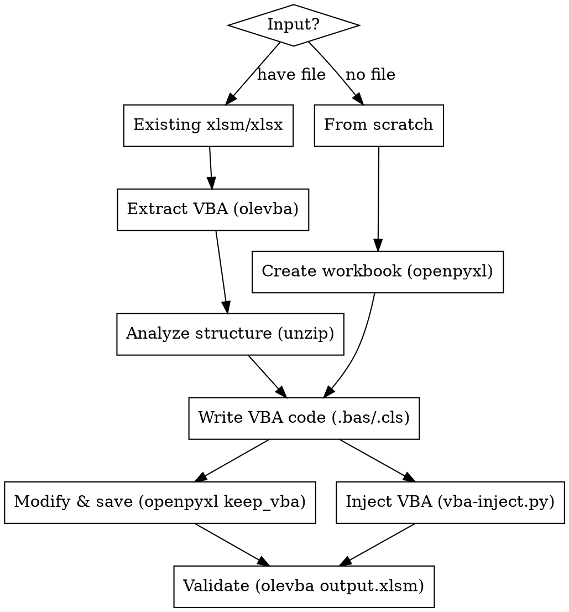

# VBA-XLSM: Creating Excel Files with VBA Macros

## Overview

Reference skill for building xlsm files with VBA macros from Claude Code. Two workflows: modify existing xlsm or create from scratch.

## Dependencies

```bash
pip install openpyxl oletools
```

No other external dependencies. VBA project assembly (`vba_project_builder.py`) uses only Python stdlib.

## Workflow



## Quick Reference

### Step 1: Analyze existing file (if provided)

```bash
# Extract VBA code
olevba input.xlsm

# Extract only VBA source (no analysis table)
olevba --code input.xlsm

# View sheet structure
unzip -l input.xlsm | grep sheet
```

### Step 2: Write VBA modules

Save VBA code as files in working directory:
- `ModuleName.bas` — standard modules (Sub/Function)
- `ThisWorkbook.cls` — workbook document module
- `SheetName.cls` — sheet document modules

**VBA file format** — write pure VBA code without `Attribute` headers:

```vba
Option Explicit

Sub MyMacro()
    ' Your code here
    Application.ScreenUpdating = False
    Application.Calculation = xlCalculationManual

    ' ... work ...

    Application.Calculation = xlCalculationAutomatic
    Application.ScreenUpdating = True
    MsgBox "Done!", vbInformation, "Complete"
End Sub
```

### Step 3a: Modify existing xlsm (preserve VBA)

```python
from openpyxl import load_workbook

wb = load_workbook('input.xlsm', keep_vba=True)
ws = wb.active
ws['A1'] = 'Modified value'
wb.save('output.xlsm')
```

Use when: modifying DATA in an xlsm while keeping its existing VBA intact.

### Step 3b: Create new xlsm with VBA

```bash
# 1. Create xlsx with openpyxl (Python script)
# 2. Inject VBA modules
python3 vba-inject.py input.xlsx output.xlsm Module1.bas
```

Or with multiple modules:
```bash
python3 vba-inject.py input.xlsx output.xlsm \
    Module1.bas Module2.bas ThisWorkbook.cls
```

### Step 4: Validate

```bash
# Verify VBA was injected correctly
olevba output.xlsm
```

Check for:
- All modules present
- No "(empty macro)" for modules that should have code
- No error messages

## Scenario: Modify existing xlsm VBA

When you need to CHANGE the VBA code in an existing xlsm (not just preserve it):

1. Extract the xlsm: `unzip input.xlsm -d /tmp/xlsm_work`
2. Extract VBA code: `olevba --code input.xlsm > existing_code.txt`
3. Write modified VBA to `.bas`/`.cls` files
4. Use `vba-inject.py` to create new xlsm with updated VBA:
   ```bash
   python3 ~/.claude/skills/vba-xlsm/vba-inject.py input.xlsm output.xlsm ModifiedModule.bas
   ```

## Common VBA Patterns

### Performance wrapper (ALWAYS use for data-heavy macros)
```vba
Application.ScreenUpdating = False
Application.Calculation = xlCalculationManual
' ... work ...
Application.Calculation = xlCalculationAutomatic
Application.ScreenUpdating = True
```

### Find sheet by keyword in name
```vba
Function FindSheetByKeyword(wb As Workbook, keyword As String) As Worksheet
    Dim ws As Worksheet
    For Each ws In wb.Worksheets
        If InStr(1, LCase(ws.Name), LCase(keyword)) > 0 Then
            Set FindSheetByKeyword = ws
            Exit Function
        End If
    Next ws
    Set FindSheetByKeyword = Nothing
End Function
```

### User confirmation dialog
```vba
Dim ans As VbMsgBoxResult
ans = MsgBox("Proceed?", vbOKCancel + vbInformation, "Confirm")
If ans = vbCancel Then Exit Sub
```

### Iterate data range
```vba
Dim lastRow As Long
lastRow = ws.Cells(ws.Rows.Count, "A").End(xlUp).Row
Dim r As Long
For r = startRow To lastRow
    ' process ws.Cells(r, col)
Next r
```

## Common Mistakes

| Mistake | Fix |
|---------|-----|
| Saving as `.xlsx` with VBA | Always save as `.xlsm` |
| Forgetting `Option Explicit` | Always add at top of every module |
| Not restoring `ScreenUpdating` | Use `On Error GoTo` or ensure cleanup runs |
| Missing `Application.Calculation` reset | Wrap in error handler to guarantee reset |
| Using `ActiveSheet` instead of explicit ref | Always use `Set ws = ThisWorkbook.Sheets("Name")` |

## Full reference

See `xlsm-reference.md` in this skill directory for:
- Complete XLSM ZIP structure
- vbaProject.bin OLE internals
- Content_Types.xml format
- Standard VBA library references (CLSIDs)
